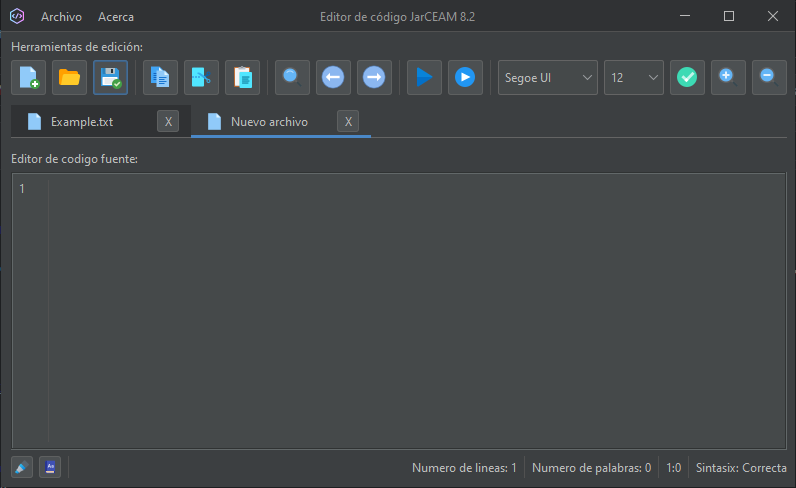

# JarCEAM 8.2 Compiler

The JarCEAM 8.2 Compiler is a compiler project for the future MP programming language. This compiler optimizes the input code, generates a symbol table, detects lexical and semantic errors, and produces a type table and assembly code.

## Screenshots

### Main Interface

### Using fonts

### Using multiple files

### Normal Interface

### Extend Interface

## Features

- Usage of the new MP programming language.
- Optimization of the input code.
- Generation of symbol table.
- Detection of lexical and semantic errors.
- Generation of type table and assembly code.
- Highlighting of correct expressions.
- Syntax indicator.
- Word dictionary.
- Font customization.
- Support for multiple tabs and multiple file usage.
- Two execution modes: normal and extended version (includes type table and assembly code).

## System Requirements

- Java Development Kit (JDK) 1.8 or higher.
- NetBeans IDE (recommended version: 8.2 or higher).
- Internet connection to download dependencies and updates.

## Project Setup

1. Clone or download this repository to your local machine.
2. Open NetBeans IDE and select "File" -> "Open Project".
3. Navigate to the location where you cloned or downloaded the repository and select it.
4. The project will open in NetBeans IDE.
5. Configure the necessary dependencies, ensuring that you have access to the required libraries and the appropriate version of Java.

## Contributing
Contributions are welcome! If you have any ideas, suggestions, or bug reports, please open an issue or submit a pull request.

## License
This project is licensed under the [MIT License](LICENSE).
